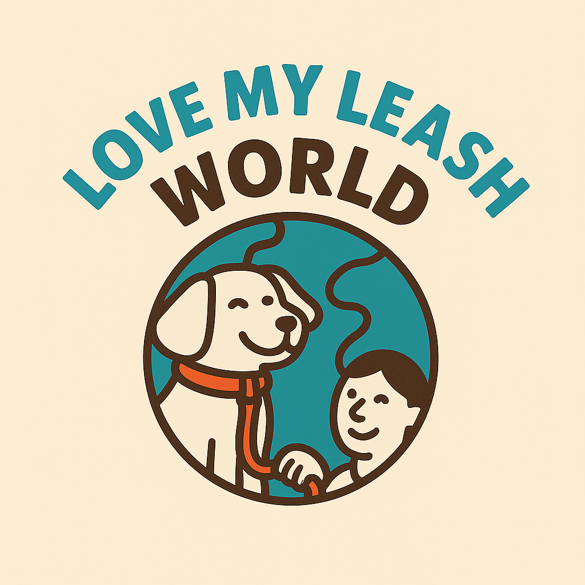

# Crowdfunding Back End
{{ Nancy Valentin }}

## Planning:
### Concept/Name
{{ Love My Leash World 🐾🌍❤️}}

### Intended Audience/User Stories
{{ A community-driven platform that connects busy, sick, or overwhelmed dog owners with caring volunteers who are happy to lend a hand. Whether you need a break, some personal time, or simply can’t manage a walk today, Love My Leash World makes it easy to find someone nearby who can step in. Volunteers can also post their availability, offering companionship and exercise for dogs while giving owners peace of mind. It’s about sharing time, building trust, and making sure every pup gets the love and walks they deserve. }}

### Front End Pages/Functionality
- {{ A page on the front end }}
    - {{ A list of dot-points showing functionality is available on this page }}
    - {{ etc }}
    - {{ etc }}
- {{ A second page available on the front end }}
    - {{ Another list of dot-points showing functionality }}
    - {{ etc }}

### API Spec
{{ Fill out the table below to define your endpoints. An example of what this might look like is shown at the bottom of the page. 

It might look messy here in the PDF, but once it's rendered it looks very neat! 

It can be helpful to keep the markdown preview open in VS Code so that you can see what you're typing more easily. }}

| URL | HTTP Method | Purpose | Request Body | Success Response Code | Authentication/Authorisation |
| --- | ----------- | ------- | ------------ | --------------------- | ---------------------------- |
|     |             |         |              |                       |                              |

### DB Schema
s