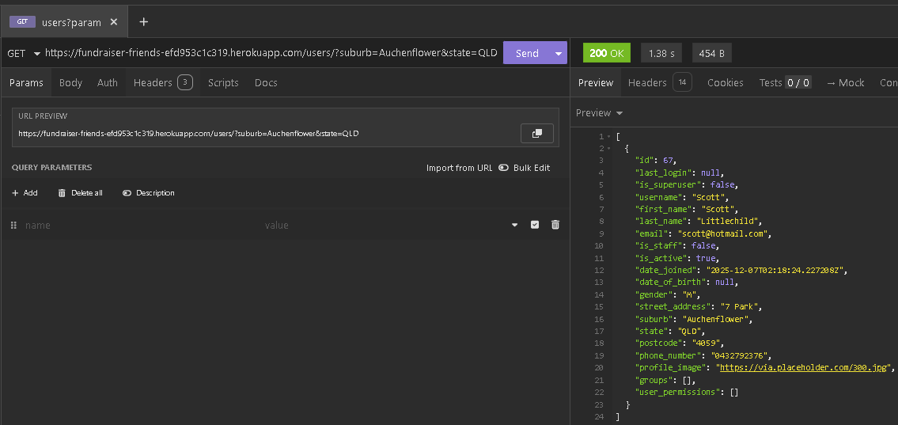
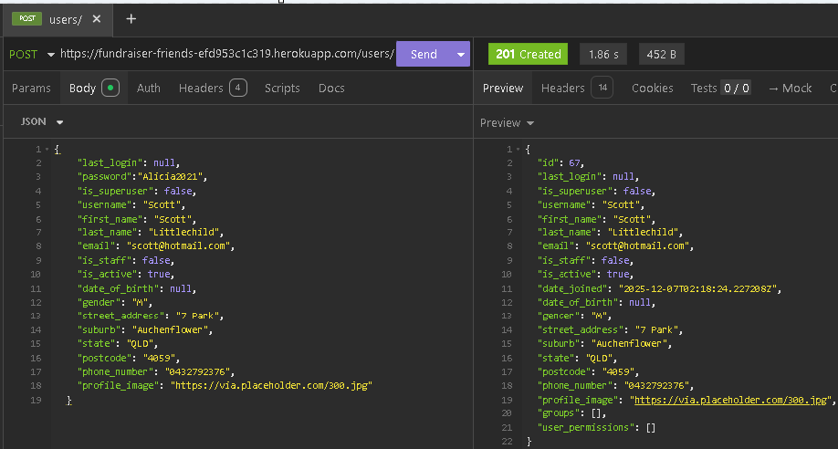
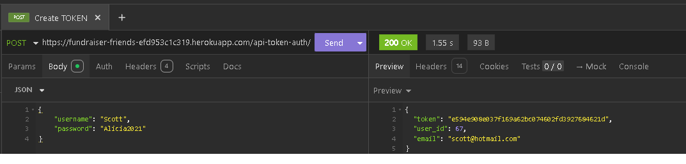
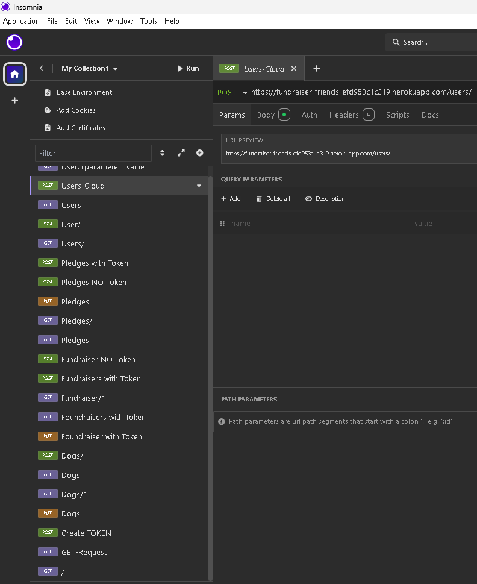
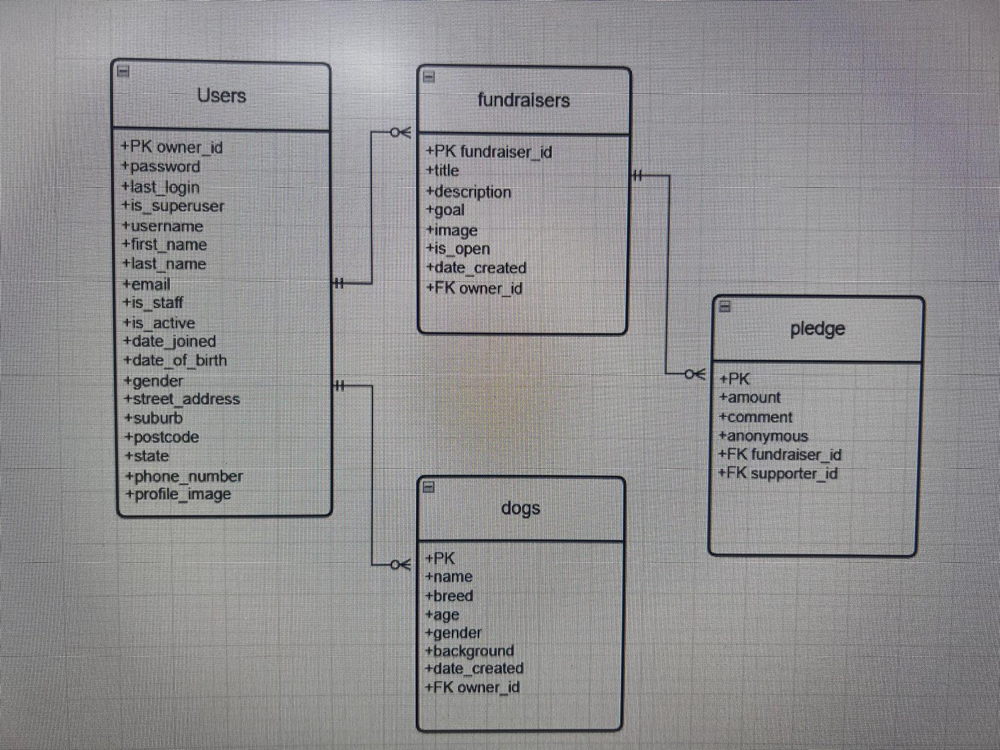

# Crowdfunding Back End
{{ Nancy Valentin }}

## Planning:
### Concept/Name
{{ Love My Leash World 🐾🌍❤️}}

### Intended Audience/User Stories
{{ A community-driven platform that connects busy, sick, or overwhelmed dog owners with caring volunteers who are happy to lend a hand. Whether you need a break, some personal time, or simply can’t manage a walk today, Love My Leash World makes it easy to find someone nearby who can step in. Volunteers can also post their availability, offering companionship and exercise for dogs while giving owners peace of mind. It’s about sharing time, building trust, and making sure every pup gets the love and walks they deserve. }}

### A screenshot of Insomnia, demonstrating a successful GET method for any endpoint.

### A screenshot of Insomnia, demonstrating a successful POST method for any endpoint.

### A screenshot of Insomnia, demonstrating a token being returned.

### Insomnia endpoints

### Step by step instructions for how to register a new user and create a new fundraiser (i.e. endpoints and body data).

| URL | HTTP Method | Purpose | Request Body | Success Response Code | Authentication/Authorisation |

https://fundraiser-friends-efd953c1c319.herokuapp.com/users/
POST
Create a new users
{
		"last_login": null,
	  "password":"Alicia2021",
		"is_superuser": false,
		"username": "Scott",
		"first_name": "Scott",
		"last_name": "Littlechild",
		"email": "scott@hotmail.com",
		"is_staff": false,
		"is_active": true,
		"date_of_birth": null,
		"gender": "M",
		"street_address": "7 Park",
		"suburb": "Auchenflower",
		"state": "QLD",
		"postcode": "4059",
		"phone_number": "0432792376",
		"profile_image": "https://via.placeholder.com/300.jpg"
}
201 Created
N/A

| URL | HTTP Method | Purpose | Request Body | Success Response Code | Authentication/Authorisation |
https://fundraiser-friends-efd953c1c319.herokuapp.com/fundraisers/  
POST
Created fundraisers
{
"title": "Walking with little Cheena, my lovely girl. Nothing better than making her happy",
"description": "Recovering from injury",
"goal": 60,
"image": "https://via.placeholder.com/300.jpg",
"is_open": true
}
201 Created
"token": "e594e908e037f169a62bc074602fd3927684621d"

| URL | HTTP Method | Purpose | Request Body | Success Response Code | Authentication/Authorisation |
https://fundraiser-friends-efd953c1c319.herokuapp.com/pledges/
POST
Created pledges
{
    "amount": 40,
    "comment": "I can take cheena for a walk after 4pm for 40 min",
    "anonymous": false,
    "fundraiser": 1
}
201 Created
{
	"token": "abdfc771282dddc8d34f08f4a53a993526c35d2f",
	"user_id": 68,
	"email": "valentin@hotmail.com"
}

### DB Schema

